# Installation Guide 
## Prerequisite
* Windows machine is used
* Java JDK 11 and latest is installed on machine
* Environment variable is set up to enable command prompt to recognize Java 
* Please do not change any file name

## Executing Program
1. Ensure `data.tsv`, `Database.jar`, and `run.bat` files are located under same directory
    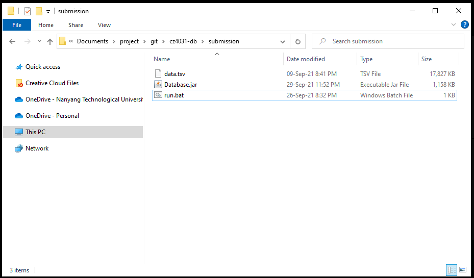 
2. double click on `run.bat` file, the program will be executed like below
    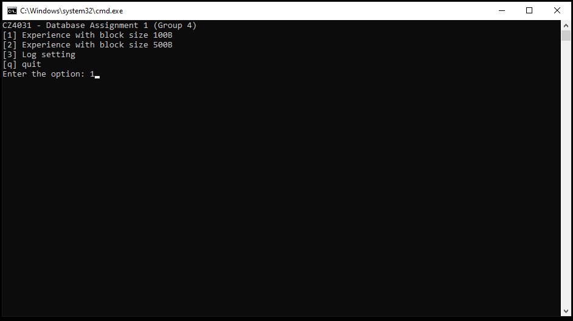
3. if you have not set up the Java environment, you will see the message like below. please follow the instructions to set up environment variable to enable windows machine to recognize java in command prompt
    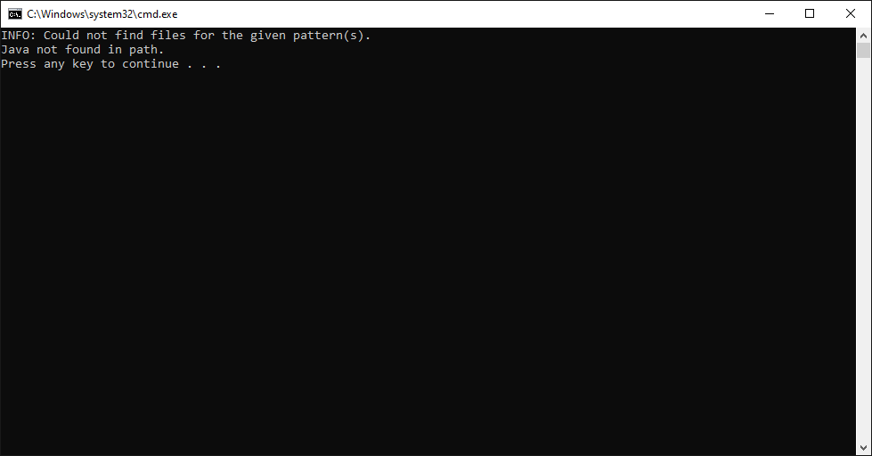

## Setting Up Environment For Java
1. Download JDK 11 or latest from https://www.oracle.com/java/technologies/downloads/

2. After download and installation of JDK, the windows machine might not be able to recognize Java yet, environment variable set up is required for command prompt to recognize java

   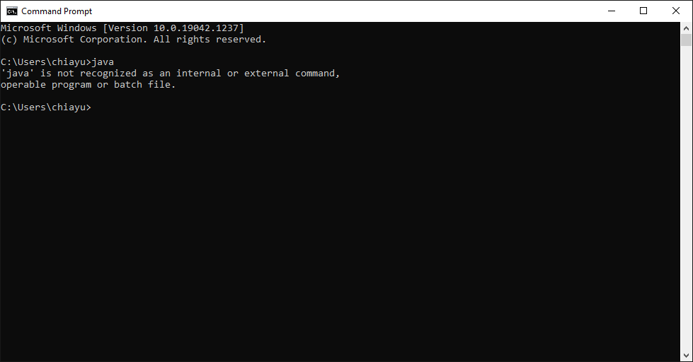

3. head to JDK installation location root folder like below
   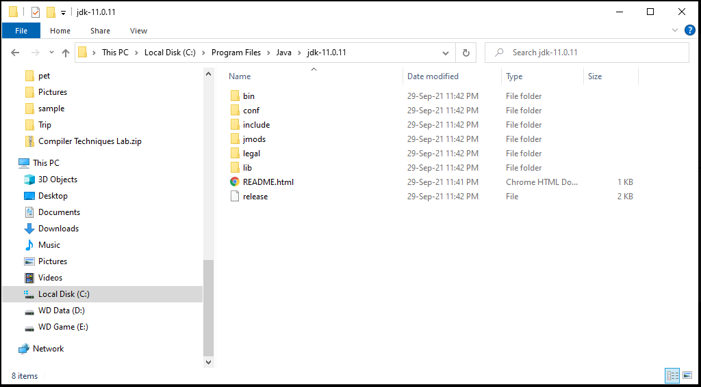

4. Copy the JDK path, for this example `C:\Program Files\Java\jdk-11.0.11` 

5. Press `Windows` key, and search for `Environment Variables` like below
   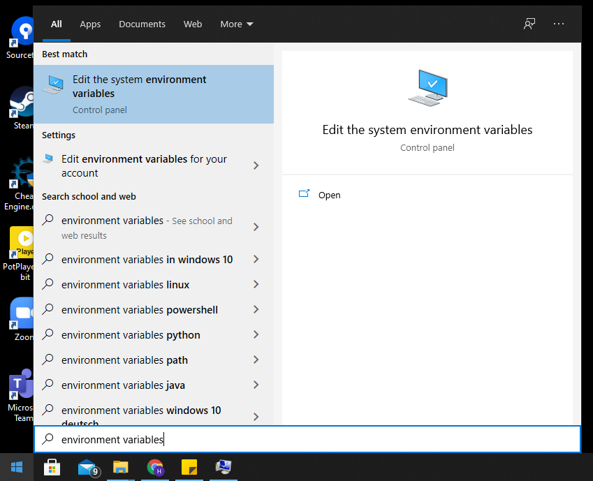

6. Select the first option, click on `Environment Variables...` then click on `New` to add new variable
   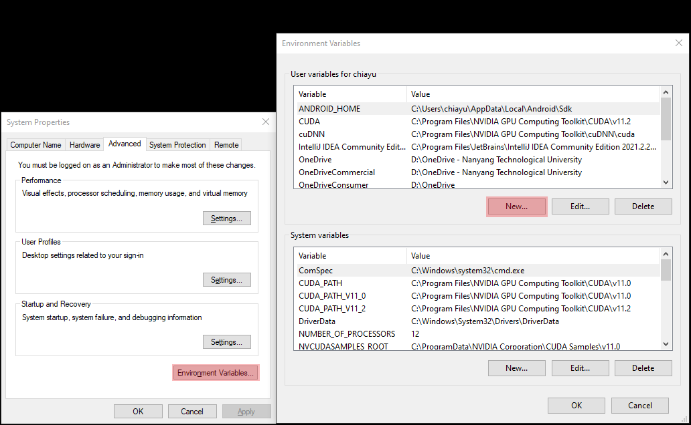

7. Add `JAVA_HOME` variable, and press `OK` like below
   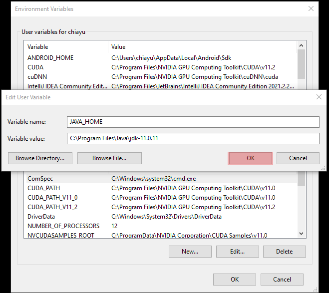

8. Confirm that `JAVA_HOME` is added in variables
   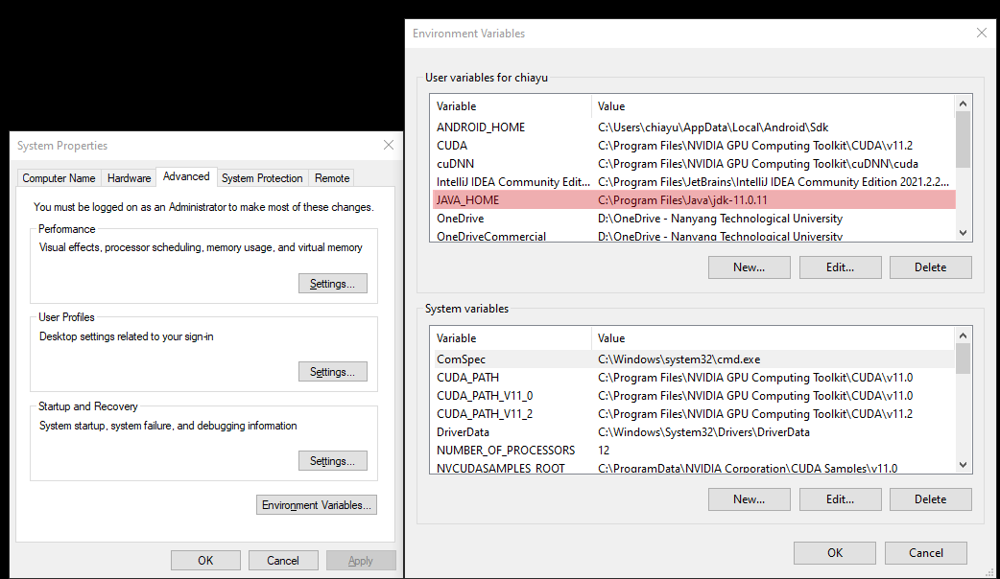

9. Next select on variable `Path` and click on `Edit`
   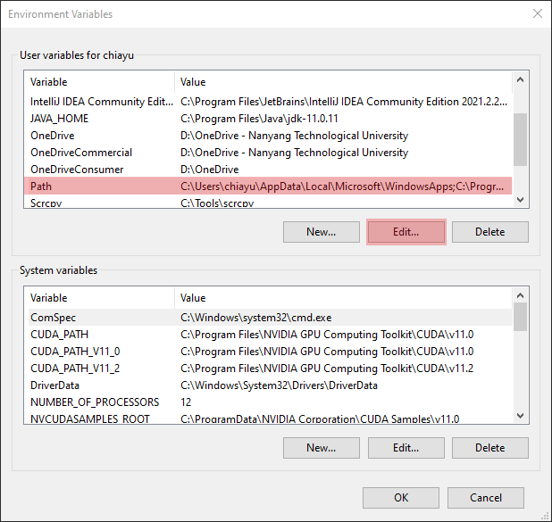

10. Adding `%JAVA_HOME%\bin` to `Path` variable and press `OK`
   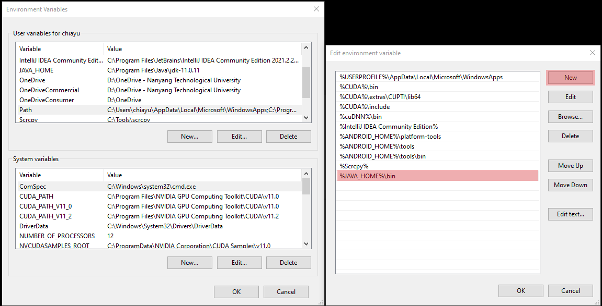

11. Environment set up is complete, verify if command prompt can recognize Java now
    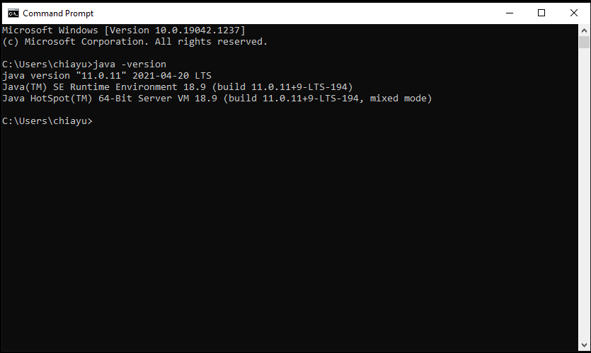

12. If command prompt can successfully recognize java, and java version is 11 and above. go back to execute our program by clicking `run.bat` file

## Other Notes
* Detailed logging of index nodes and data blocks access are only available when log level set to verbose 

