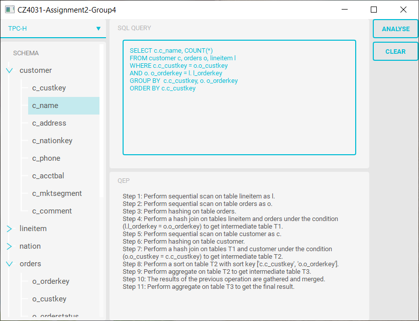

# Assignment 2

## Objective
* Design and implement an efficient algorithm that produces a description of the Query Execution Plan (QEP) based on an input query


## Submission files

* `interface.py`, `main.ui`: code and layout for the GUI
* `annotation.py`: code for generating the annotations
* `project.py`: main file that invokes all the necessary procedures 


## Setting up project

* Create a `config.json` file  like below and place it in same directory as `project.py`, please note that more databases configurations can appended if necessary 

  ```json
  {
  	"TPC-H": {
  		"host": "localhost",
  		"dbname": "db4031",
  		"user" : "database_username",
  		"pwd" : "database_password",
  		"port" : "5432"
  	},
  	"IMDB": {
  		"host": "localhost",
  		"dbname": "imdb",
  		"user" : "database_username",
  		"pwd" : "database_password",
  		"port" : "5432"
  	}
  }
  ```

* Create a virtual environment with Anaconda (optional)
  ```shell
  conda create --name cz4031a2 python=3.9.6
  conda activate cz4031a2
  ```
  
* Install required frameworks and libraries
  ```shell
  pip install -r requirements.txt
  ```


## Executing the program

* Ensure [PostgreSQL][2] database is hosted, databases set up instruction can be found in set up folder
* Execute the program with following command

  ```shell
  python project.py
  ```
* Program should be started like below



## Dataset

* [TPC-H ][1] - v3.0.0 is used in the project
* [IMDB][2]


## Tools

* [PostgreSQL][3]
* [pgAdmin][4]
* [PyQt5][5]


[1]:http://www.tpc.org/tpc_documents_current_versions/current_specifications5.asp
[2]:https://www.imdb.com/interfaces/
[3]:https://www.postgresql.org/
[4]:https://www.pgadmin.org/
[5]: https://riverbankcomputing.com/software/pyqt/intro
[6]:https://www.qt.io/qt-for-python
[7]:https://doc.qt.io/qt-5/qtdesigner-manual.html
