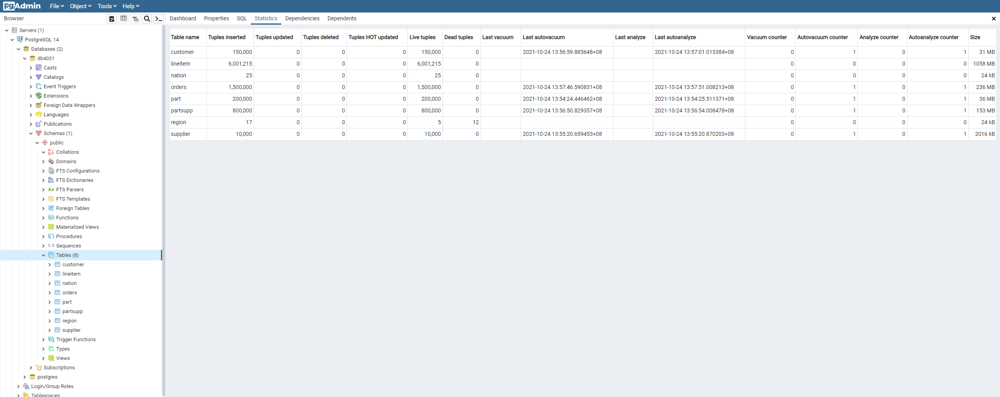

# cz4031-db

## Step 1: generating data with TPC-H tool

- download [TPC-H ](http://www.tpc.org/tpc_documents_current_versions/current_specifications5.asp) data
- run `dbgen` to generate .tbl data
  

## Step2: Converting .tbl file to .csv file

- a simple program is written for file conversion

## Step3: Download PostgreSQL and pgAdmin4

- download and install [PostgreSQL](https://www.postgresql.org/), it should have [pgAdmin4](https://www.pgadmin.org/) included

## Step4: Create first database - 'db4031'

- Open pgAdmin4
- On the side bar, right click on database, and select Create Database
- Name the database as `db4031` and click on 'Save'

## Step5: Create schema with Query Tool

- first right click on database 4031, and click on Query Tool
  
- In the Query Tool panel, open the predefined schema creation query file (`db_init.sql`)
  
- clicked on run button to execute queries
  

## Step6: Import the data with .csv file

- right click on respective table for example `customer` table and choose import
  
- change to import, select the data file and clicked on save
  
- after everything done, clicked on statistic it should show the live touples count
  

## Step7: Create second database - db4031-imdb

- IMDb dataset can be downloaded from: https://datasets.imdbws.com/
- title.ratings.tsv.gz and title.basics.tsv.gz will be used in this section.
- Following steps 5-6, create a second database with the name db4031-imdb
  
- In the Query Tool panel, open the predefined schema creation query file (`db_imdb_init.sql`)
  
- clicked on run button to execute queries
- Import the data using .tsv file for both the title and ratings tables by right clicking on respective table then select "import".
- Import options: format: "text", delimiter: "[tab]".
  
  
